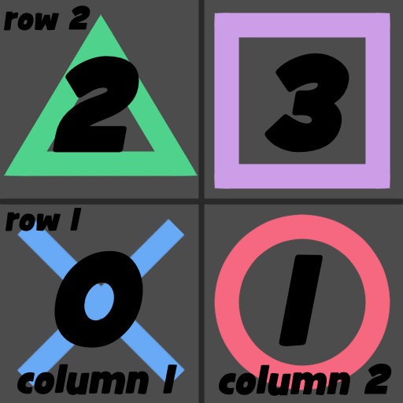

<pre>
<head>
	<title>Super Text Mesh Documentation</title>
	<link rel="shortcut icon" type="image/png" href="/STMDocImages/favicon.png"/>
</head>

</pre>
 
 
 
<article class="column"><article class="banner">
 
 
Super Text Mesh Documentation - v1.8.14
</article><article class="tableofcontents"><article class="textarea">
#Table of Contents

[Features](#Features)

1. [Adding Super Text Mesh to Unity](#Adding Super Text Mesh to Unity)
	* [Importing Super Text Mesh into Unity](#Importing Super Text Mesh into Unity)
	* [Adding Super Text Mesh to a Scene](#Adding Super Text Mesh to a Scene)
2. [Text Data File & Rich Text Tags](#Text Data File & Rich Text Tags)
	* [Text Data](#Text Data)
	* [Text Data Customization](#Text Data Customization)
	* [Rich Text Tags](#Rich Text Tags)
3. [Functions, Variables & Events](#Functions, Variables & Events)
	* [Public Functions](#Public Functions)
	* [Public Variables](#Public Variables)
	* [UnityEvents & Delegate Events](#UnityEvents)
4. [Shaders & Shadows](#Shaders & Shadows)
	* [Changing Shaders & Included Shaders](#Changing Shaders & Included Shaders)
	* [Clues for Writing Custom Shaders](#Clues for Writing Custom Shaders)
	* [Enabling Shadowcasting](#Enabling Shadowcasting)
	* [Outlines and Dropshadows](#Outlines and Dropshadows)
	* [SDF Fonts](#SDF Fonts)
5. [Utilities](#Utilities)
	* [Curve Generator](#Curve Generator)
	* [Change Sorting Order](#Change Sorting Order)
	* [Support Packages for Other Assets](#Support Packages for Other Assets)

[Notes](#Notes)  
[FAQ](#FAQ)  
[ChangeLog](#ChangeLog)  
[Update Warnings](#Update Warnings)  
[Credits](#Credits) 
</article></article><article class="textarea">

***

#Features
* Super Text Mesh is a text-rendering asset for Unity, with similar implementation to Unity's default text mesh. Its primary focus is accessibility towards developers and players, and is made to work easily with in-game dialogue.
* Size and quality (font point size) are independent of each other. You can adjust the quality of a character without changing its size in-editor. This makes it much easier to get text to be the right size while looking sharp.
* Animated text effects! Text can move in completely customizable wave and jitter patterns!
* A universal switch to disable animated text effects, for adding easy accessibility to games.
* Text color can be set from a hex code, or from a definable preset.
* Moving gradients and textures can also be used as a text color!
* Lots of customization, kept simple. All customizations are kept files shared across all text meshes in your project. You can toss these settings to friends, back them up with source control, and save them for later projects.
* Text wrap is shown with a visible bounding box.
* Built for dialogue! There are several ways to tweak sound effects, writing animations, and more. You can even expand on this with custom events!
* Animated inline images (quads).
* Outlines and Drop Shadows.
* Signed distance field (SDF) support!
* Best fit text options!
* Works great with mobile platforms! Featured in game releases on PS4, Xbox One, and Nintendo Switch too!
* Works with Unity UI!
* Surprisingly fast support, or so I've been told.

***

#1. Adding Super Text Mesh to Unity

##a. Importing Super Text Mesh into Unity

<article class="rightbox">
  
Recommended minimum install.
</article>

To import Super Text Mesh into your project, either drag in the .unitypackage file, or get it from the asset store window.

###Imported folders, what they do, and if you need to import them or not, alphabetically:

* __"DefaultMedia"__ contains media that's referenced by the TextData assets in the resources folder. If you don't import it it'll break some of the default settings, but it's not required.
* __"Documentation"__ contains these docs! You don't need to import them, but you probably should!
* __"Materials"__ is a spot to put user-made materials for Super Text Mesh. Not neccesary, but it'll help keep things organized. If you create a new material using the "new" button next to material settings in Super Text Mesh, your new material will automatically end up here.
* __"Prefabs"__ contains prefabs to be instantiated by Super Text Mesh, if you add it to a scene through the "GameObject" menu. If you only plan to add Super Text Mesh to a scene as a component, you don't need this folder.
* __"Resources"__ contains the "TextData" file and other assets referenced directly by Super Text Mesh's script. All folders and assets directly inside are required, but everything inside those folders is not, as those are just default settings.
* __"Sample"__ has resources for the example scene, and default media used by TextData. If you don't need to see the example scene, you don't need this folder.
* __"Scripts"__ contains the actual code for Super Text Mesh and its icons. Required.
* __"Shaders"__ contains different default shaders for Super Text Mesh. All the .cginc files should be imported. The "Unlit" shader is required as well as the "UI" one, as they're default and an error will be returned if this shader can't be found. The rest don't have to be imported.
* __"Utility"__ contains a script that generates AnimationCurves that you can save, and then load into curve fields. Also contains a script that lets you change the sorting order of STM or any object with a renderer. Not required.

Additional support packages are listed under [Support Packages for Other Assets](#Support Packages for Other Assets).

The outline shaders take a long time to compile, so don't import them if you're in a hurry or don't want to use them.

##b. Adding Super Text Mesh to a Scene

<article class="rightbox">
  
Adding as a new Game Object.
</article>

To add it as a new GameObject, you can also go "GameObject > 3D Object > Super 3D Text", to create a new Text Mesh object. This option may require a reset of Unity to appear, initially.
"GameObject > UI > Super Text" is the path for adding a new UI Text object. Please do not add Super Text Mesh to your game by dragging in the prefabs from the "prefabs" folder. Those only exist so adding it from the GameObject menu can work!

To add Super Text Mesh to an existing object in your project, you can select "Add Component" on an existing GameObject and find it under "Mesh > Super Text Mesh". Even when adding it as a UI element, you can add it this way, as long as the object you're adding it to is already the child of a canvas (if it has a RectTransform).

***

#2. Text Data File & Rich Text Tags

##a. Text Data

<article class="rightbox">
  
The inspector window.
</article>

In "Assets > Clavian > SuperTextMesh > Resources", you'll find a set of files used to change the presets of all text meshes in your project. You can edit these directly here, or click on the "[T]" icon in any Super Text Mesh's inspector to edit them with a custom inspector!

This file allows customization of effects called by Super Text Mesh's rich text tags. For example, you can define a color named "1" to be called with the tag ``<c=1>``, or a text delay to be called using ``<d=myDelay>`` so you wouldn't have to type the same number over and over to call the same effect.

##b. Text Data Customization
Lots of Super Text Mesh's settings can be changed mid-strin`g with tags such as ``<c=red>`` to change text to be red, or ``<d=10>`` to insert a delay that would be equal to 10 characters being read out. Most tags can be customized in a group of assets referred to as "TextData".

All TextData files can be found within "Assets > Clavian > SuperTextMesh > Resources" and can be edited there, or by clicking the [T] icon within a Super Text Mesh component. The name of the file will determine what tag it uses (eg. A color named "Teal" would be called with ``<c=Teal>``).

When editing in the Super Text Mesh inspector, each TextData file has a header with a button to ping the asset in the project folder, a button to delete it, and a bar where the name can be edited. At the bottom of each group is a button to create a new asset, and at the very bottom of the inspector is a button to refresh the database, incase you make assets outside of the inspector.

Waves, Jitters, and Delays all have customizable default settings. When you go to edit them, you'll notice a setting named "default". This will be the setting called by the basic version of this tag. (``<w>``, ``<j>``, ``<d>``.) These can be changed to whatever settings you want.
In other words, using the ``<w>`` tag would be the same as calling ``<w=default>``.

For autodelays and autoclips, you might want to have a delay or a clip inserted for a character that can't be saved in a file name, such as "?", "!", ".", etc. For these, use the written-out name of these characters instead:
"space", "tab", "line break", "exclamation point", "question mark", "semicolon", "colon", "tilde", "period", "comma", "number sign", "percent", "ampersand", "asterix", "backslash", "forwardslash", "openbrace", "closebrace" 

You can also reference quads this way! If you have a quad named "cross", then when you type ``<q=cross>`` into a mesh, it'll react to autodelays, autoclips, and sound clips named "cross".

Other aspects of Super Text Mesh, like draw animations, automatic voice clips, and master switches are also controlled with these text data files.

* ###Effects

	* ####Waves [``<w>`` / ``<w=name>``]
		<article class="rightbox">
		  
		Editing a wave.
		</article>
		* __"Animate From Time Drawn"__ makes it so the animation of this wave is based on when a letter gets read by a text mesh. Using this, you can have waves that "cool down" over time by making their curves not loop, for example.
		* __"Position Control"__ determines whether positional data is used or not.
		* __"Position"__ sets the positions for this wave.
			"Curve X/Y/Z" is how the wave will move on the X/Y/Z axises.
			"Phase" is a value from 0 to 1, representing the point on the curve where the animation starts.
			* __"Speed"__ is how fast the wave will play, multiplied by Time.time.
			* __"Strength"__ is how far the wave will move letters away from their centers.
			* __"Density"__ is how tight/loose the wave will be.
			All 3 of these aspects can be controlled inarticleidually on all 3 axises, and can also be negative.
		* __"Rotation Control"__ determines whether rotational data is used or not.
		* __"Rotation"__ sets the rotations for this wave.
			Fields here are similar to "position" except for...
			* __"Pivot"__ determines the pivot point for this rotation. The x value is based on individual letter width, and the y value is based on individual letter size.
		* __"Scale Control"__ determines whether scale data is used or not.
		* __"Scale"__ sets the scales for this wave.
			Fields under scale are similar to the ones under "position" and "rotation"!
		* __"Individual Vertex Control"__ determines if the four below values are active or not.
		* __"Top Left/Top Right/Bottom Left/Bottom Right"__ are all similar to "Position", but they let you assign a wave to each corner of a letter's mesh. You can do some pretty crazy effects with this, such as the "seasick" wave example.

	* ####Jitters [``<j>`` / ``<j=name>``]
		* __"Amount"__ is the max distance that letters will jitter.
		* __"Perlin"__ decides if the jitter will use perlin noise or not.
		* __"Perlin Time Multiplier"__ decides the speed of the jitter, if perlin mode is on.
		* __"Distance"__ can be used to change how far out the jitter will go on average. A linear curve is the default.
		* __"Distance Over Time"__ will be how far the jitter will reach, after being drawn. It should just be a horizontal line, if you want it to be permenant.
		* __"Distance Over Time Scale"__ is a multipler of the above curve.

	* ####Draw Animations
		Draw animations aren't called through tags, but instead a string field on text meshes that have a read delay. They are also used in reverse for undrawing animations.
		* __"Anim Time"__ is how long the animation will last.
		* __"Anim Curve"__ is the curve the animation will take.
		* __"Start Scale"__ is a multiple of the size of a letter, from its center. When it starts drawing out, the letter will be at this scale. ((1,1,1) means it won't change in scale, (0,0,0) means it will start invisible)
		* __"Start Offset"__ is, relative from the center of a letter, where it will be at the start of the draw animation. For instance, (-1,0,0) would start the letter a bit to the left.
		* __"Fade Time"__ is how long the letter will take to fade in. If set to 0, it'll just appear.
		* __"Fade Curve"__ is the curve the fade will take.
		* __"Start Color"__ is the initial color of the mesh. Should be left at (0,0,0,0) if you dont want to do something like the default "Fill" animation.

* ###Text Color
	* ####Colors [``<c>`` / ``<c=name>``]
		Define colours by name to be called by the ``<c=name>`` tag.

	* ####Gradients [``<c>`` / ``<c=name>``]
		Define a gradient to be called by the ``<c=name>`` tag.
		* __"Gradient"__ is defined using Unity's gradient editor.
		* __"Gradient Spread"__ is how far the gradient stretches over the text mesh.
		* __"Scroll Speed"__ is how fast the gradient moves. Can be set to 0 to not animate, or negative to scroll in reverse. If set to 0, this skips redrawing the mesh every frame.
		* __"Direction"__ is the gradient's direction. Horizontal and Vertical are the only options.
		* __"Smooth Gradient"__, if unchecked will make it so only one color will be present on each letter. All four vertices on a letter will have the same color set for them.

	* ####Textures [``<c>`` / ``<c=name>``]
		Define a texture to color text with. Also called with the ``<c=name>`` tag.
		* __"Texture"__ is the texture to be used. Make SURE the texture you use is set to "Repeat", not "Clamp"!!
		* __"Relative to Letter"__ determines if the texture will be relative to each individual letter, or not.
		* __"Scale with Text"__ makes it so your texture's size stays locked to the text's size, or not.
		* __"Tiling"__ is how big the texture will be, mapped to the text.
		* __"Offset"__ is an additional offset for the texture.
		* __"Scroll Speed"__ is how fast the texture will move. Can be set to 0 to be static. (This will skip redrawing the mesh every frame)

* ###Inline
	* ####Delays [``<d>`` / ``<d=name>``]
		Delays can be defined here, to be called back quickly using tags instead of numbers.

	* ####Voices [``<v>`` / ``<v=name>``]
		Define longer strings that can be inserted with shorter ones, called by ``<v=name>``. Good for setting multiple things at once, and defining different settings for characters. The usage is similar to text macros.

	* ####Fonts [``<f>`` / ``<f=name>``]
		You can define a font to be called with the ``<f=name>`` tag, here.

	* ####Audio Clips [``<audioClips=name>``]
		Changes the set of audio clips to be used.

	* ####Sound Clips [``<clips=name>``]
		Adds a set of auto clips to be used. For adding auto clips mid-string.

	* ####Quads [``<q=name>`` / ``<q=name,index>`` / ``<q=name,xPos,yPos>``]
		<article class="rightbox">
		  
		How quad columns work.
		</article>
		Used to define quads, inline images that can be used in a similar fasion to emoji.
		When writing out the tags for quads, you can override the index or get a quad at a specific point in your texture if you don't want to define multiple quads in the inspector!

		* __"Texture"__ The texture used by this quad.
		* __"Silhouette"__ determines whether the quad will respect font color or not. If set to true, it will respond to color like any other character in a font, but if false it will display its colors true to the texture.
		* __"Filter Mode"__ changes the filter mode of the texture.
		* __"Columns"__ determines how many subdivisions exist in the texture sheet, vertically.
		* __"Rows"__ determines how many subdivisions exist in the texture sheet, horizontally.
		* __"Icon Index"__ If the column count  or row count is greater than one, this will determine which area of the texture will be used for this quad. The diagram demonstrates how this works with a default textures.
		* __"Anim Delay"__ is used for animated quads. This value determines the delay between frames. If set to 0, it doesn't animate.
		* __"Frames"__ this integer array is used instead of Icon Index for an animating quad. It determines which indexes are used, in what order.
		* __"Size"__ controls how much space the quad takes up, relative to the current font size.
		* __"Offset"__ moved around the entire quad without effecting text spacing, usually for making centering corrections.
		* __"Advance"__ adds extra space between this character and the next one.

	* ####Materials [``<m=name>``]
		Defines materials to switch to mid-string.

* ###Automatic
	* ####Auto Delays
		Automatic delays that happen after specific characters can be defined, here. They only occur if the following character in a string is a space, tab or line break.
		* __"Character"__ is the character this delay will be looking for.
		* __"Count"__ is the delay amount, which is a multiple of a text mesh's reading speed. (A count of 2 on a Text Mesh where delay is set to 0.1 will result in a delay of 0.2 seconds.)

		An auto delay will be inserted _after_ its character is read out.

	* ####Auto Clips
		Certain audio clips can be defined to play for specific characters, here.
		If "Clip" is undefined, a sound will NOT be played for this character. This is good for spaces, line breaks, and tabs, all of which are defined for this by default.
		This feature could also be used to set up a typewriter, so you can have it make the distinctive "ding" sound, every time a line break is read out.
		* __"Ignore Case"__ tells Super Text Mesh to not care about the character's case. ("M" and "m" will be treated the same)

* ###Master
	* ####Disable Animated Text
		For accessibility, you can use this bool to easily enable/disable ALL animated text effects in your game. To call it with code, you can use "``SuperTextMesh.data.disableAnimatedText``".

	* ####Default Font
		This will be the font STM will fallback to. By default, this value is Arial, Unity's built-in font. It's only suggested to change this if you are having issues with Arial as a fallback, since the default font will be used if a character doesn't exist in a font and Arial seems to have every character Unity supports available.

	* ####Bounds Color
		Controls the colour of STM's autoWrap/verticalLimit bounds gizmos. Set transparency to 0 to disable.

	* ####Text Bounds Color
		Controls the colour of STM's text bounds gizmos. Set transparency to 0 to disable.

	* ####Bounds Color
		Controls the colour of STM's final text bounds gizmos. Set transparency to 0 to disable.

##c. Rich Text Tags

<article class="rightbox">
  
Demonstration of some tags.
</article>

These tags can be used mid-string to change aspects of the text! Any tag that has "name" on it like "``<c=name>``" can be modified with the [Text Data file](#Text Data). All tags can be closed with a tag like "``</c>``", for example.

* __Color__ [``<c>`` / ``<c=name>`` / ``<c=hexcode>`` / ``<c=``[DefaultColorName](https://docs.unity3d.com/ScriptReference/Color.html)``>``] Change color/gradient/texture of text. Hex code is without the # symbol, and supports alpha (8 digit hex code).
* __Relative Size__ [``<s=float>``] Change size of text, relative to the default size.
* __Delay__ [``<d>`` / ``<d=int>`` / ``<d=string>``] For reading out text, insert a delay that's worth the time it takes to read out x amount of characters, or use a predefined delay amount.
* __Timing__ [``<t=float>``] Set the exact time the following letters will read from. Good for syncing up text to something.
* __Event__ [``<e=string>``] Will invoke a [custom event](#UnityEvents) when the text mesh reads it.
* __Repeating Event__ [``<e2=string>``] Will do the same as the normal event tag, but repeat for each letter until cancelled with ``</e2>``.
* __Voice__ [``<v=name>``] Shortform to insert a longer string.
* __Font__ [``<f=name>``] Changes the font mid-string.
* __Material__ [``<m=name>``] Changes material mid-string.
* __Quad (Inline Image)__ [``<q=name>`` / ``<q=name,index>`` / ``<q=name,xPos,yPos>``] Inserts a quad. The index can be overridden.
* __Bold__ [``<b>``] Set text to be bold. Can stack with italic.
* __Italic__ [``<i>``] Set text to be italic. Can stack with bold.
* __Wave__ [``<w>`` / ``<w=name>``] Use a wave from the Text Data file.
* __Jitter__ [``<j>`` / ``<j=name>``] use a jitter fromt he Text Data file.
* __Alignment Tags__ [``<a=alignment>``] These will set text alignment, mid-string.  
	* __Left__ [``<a=left>``] Align text left.
	* __Right__ [``<a=right>``] Align text right.
	* __Center__ [``<a=center>`` / ``<a=centre>``] Align text to be centred.
	* __Justified__ [``<a=just>`` / ``<a=justify>`` / ``<a=justified>``] Justify text, paragraph-style.
	* __Force Justified__ [``<a=just2>`` / ``<a=justify2>`` / ``<a=justified2>``] Force text to be justified, even if it breaks traditional paragraph rules.
* __Line Break__ [`` ``] Inserts a line break, the same as typing ``\n``. Good for inserting line breaks on single-line text entry fields.
* __Indent__ [``<indent=float>``] Sets a margin in localspace units.
* __Pause__ [``<pause>``] Tells the mesh to stop reading at this point until Continue() is called.

Other elements of Super Text Mesh can be changed directly with tags, but these are meant to be changed with voice tags, as they are longer than standard tags. Still, you can use them in regular text, too:

* __Size__ [``<size=float>``] Set the exact size of text.

* __Stop Previous Sound__ [``<stopPreviousSound=bool>``] Change audio settings.
* __Pitch Mode__ [``<pitchMode=PitchMode>``] Change audio settings.
	* __Normal__ [``<pitchMode=normal>``] Set the pitch mode to "Normal".
	* __Single__ [``<pitchMode=single>``] Set the pitch mode to "Single".
	* __Random__ [``<pitchMode=random>``] Set the pitch mode to "Random".
	* __Perlin__ [``<pitchMode=perlin>``] Set the pitch mode to "Perlin".
* __Override Pitch__ [``<overridePitch=float>``] Set the pitch for the "Single" pitch mode.
* __Minimum Pitch__ [``<minPitch=float>``] Set the minimum pitch for the "Random" & "Perlin" pitch mode.
* __Maximum Pitch__ [``<maxPitch=float>``] Set the maximum pitch for the "Random" & "Perlin" pitch mode.
* __Speedread Pitch__ [``<speedReadPitch=float>``] Set the pitch to be used for speedreading.
* __Auto Clips__ [``<clips=string>``] Use specific auto clips.
* __Audio Clips__ [``<audioClips=string>``] Change the audio clips being used.

* __Draw Animation__ [``<drawAnim=string>``] Case-sensitive. Set the name of the draw animation to be used.
* __Draw Order__ [``<drawOrder=DrawOrder>``]
	* __Left To Right__ [``<drawOrder=lefttoright>`` / ``<drawOrder=ltr>``]
	* __All At Once__ [``<drawOrder=allatonce>`` / ``<drawOrder=all>``]
	* __One Word At A Time__ [``<drawOrder=onewordatatime>`` / ``<drawOrder=robot>``]
	* __Random__ [``<drawOrder=random>``]
	* __Right To Left__ [``<drawOrder=righttoleft>`` / ``<drawOrder=rtl>``]
	* __Reverse LTR__ [``<drawOrder=reverseltr>``]

***

#3. Functions, Variables & Events

##a. Public Functions

These functions can be called with code, and are useful for dialogue managers:

* ###void SuperTextMesh.Rebuild()
	Call this to update the mesh's text. This will also cause it to read out again, if the read delay is above 0.

* ###void SuperTextMesh.Rebuild(bool readAutomatically)
	Can be used to rebuild the mesh without automatically reading out. Good for some text boxes. Will override the "autoRead" variable.

* ###[STATIC] void SuperTextMesh.RebuildAll()
	Will call Rebuild() on every mesh in the scene. Should only be used when starting a scene as it uses FindObjectsOfType, which is very intensive.

* ###void SuperTextMesh.Read()
	You can use this to have text get re-read without rebuilding the mesh.

* ###void SuperTextMesh.Read(float startTime)
	You can also get the mesh to read from a specific point.

* ###void SuperTextMesh.SpeedRead()
	Tells the text mesh to switch to its faster reading speed.

* ###void SuperTextMesh.RegularRead()
	Tells the text mesh to return to its regular reading speed.

* ###void SuperTextMesh.SkipToEnd()
	Makes the mesh finish drawing immediately, calling all events that haven't been read yet.

* ###void SuperTextMesh.Append(string)
	Add to the end of the current text mesh string, and begin reading from this point.

* ###void SuperTextMesh.UnRead()
	Tell the mesh to play its "undrawing animation". Other aliases for this function are "Unread()", "UnDraw()", and "Undraw()". After the animation finishes, the mesh won't update until Rebuild() is called again.

* ###bool SuperTextMesh.Continue()
	Tells the mesh to continue past a ``<pause>`` tag. Will return true if any more pauses needed to be passed by, and false if the end of the mesh was already reached.

##b. Public Variables

All public variables can be changed with code, if needed.

###Text

* ###string SuperTextMesh.text
	Same as SuperTextMesh._text, but Rebuild() will be called automatically upon setting.

* ###string SuperTextMesh._text
	This is the text stored within the text mesh. The text mesh will not display it until Rebuild() is called. There's an underscore there, by the way, it's just covered up by the underline.

* ###[READ ONLY] string SuperTextMesh.drawText
	Text that the mesh will display. So this is the same as SuperTextMesh.text, but after being processed as rich text! If rich text is turned off, this will be the same as SuperTextMesh.text. This string will not include automatically-inserted hypens and line breaks.

* ###[READ ONLY] string SuperTextMesh.hyphenedText
	Text that the mesh will display, including characters that may have been added like hyphens and line breaks.

* ###[READ ONLY] bool SuperTextMesh.reading
	This bool returns true if the text mesh is currently reading out text. Returns false when the mesh has finished, or if the mesh has a read delay of 0.

* ###[READ ONLY] bool SuperTextMesh.unreading
	This bool returns true if the text mesh is currently playing its unreading animation.

###Appearance

* ###Font SuperTextMesh.font
	The font to be used by the text mesh.

* ###Color32 SuperTextMesh.color
	Default color used by this text mesh.

* ###float SuperTextMesh.size
	Size of this text in local space. For UI elements, this is the size in screen space.

* ###SuperTextMesh.BestFitMode SuperTextMesh.bestFit
	Controls Best Fit text.  
	* __BestFitMode.Off__  
		Text will not use best fit.  
	* __BestFitMode.Always__  
		Text will be the right size to match with autoWrap's bounds.  
	* __BestFitMode.OverLimit__  
		Text will only shrink if it goes over autoWrap's bounds.  

* ###FontStyle SuperTextMesh.style
	Default font style for the text mesh.

	* __FontStyle.Normal__
	* __FontStyle.Bold__
	* __FontStyle.Italic__
	* __FontStyle.BoldAndItalic__

* ###bool SuperTextMesh.richText
	If this text mesh responds to rich text tags or not.

* ###int SuperTextMesh.quality
	This is a font's point size.

* ###FilterMode SuperTextMesh.filterMode  
	Filter mode to be used by the text mesh.  
	* __FilterMode.Point__  
		Texture pixels become blocky up close. Good for pixel fonts.  
	* __FilterMode.Bilinear__  
		Texture samples are averaged, looks smoother.  
	* __FilterMode.Trilinear__  
		Texture samples are averaged, and blended between mipmap levels. 

	A note about filter modes! If two text meshes are using the same font, but with different filter modes applied, the material settings will get confused and blink between filter modes. I suggest duplicating your font in the assets folder and using the different filter mode on this new font to avoid this.

* ###Material SuperTextMesh.textMaterial;
	<article class="rightbox">
	  
	Material controls.
	</article>
	The default material being used by this mesh. Will be referenced by the mesh upon rebuild, and should be treated as "a shader, with settings". A good example of this is that if you had an in-game keyboard made up of several Super Text Meshes, they could all share the same material and changes could be made to all of them quickly this way.

	NOTE: This value is only referenced once Rebuild() is called, where Super Text Mesh will then create an internal material that the mesh will reference instead. This is done so that multiple fonts can use the same material's look. So the above trick with changing a single material to effect multiple meshes only works in edit mode.

###Position

* ###Vector3 SuperTextMesh.baseOffset
	Additional offset for the mesh from the anchor point.

* ###TextAnchor SuperTextMesh.anchor
	Anchor point of the text box. In UI mode, upper/middle/lower anchors can be adjusted. This also controls where text will draw from if you have bounds defined. (Bottom-anchored text will snap to the bottom of your defined bounds.)
	* __TextAnchor.UpperLeft__
	* __TextAnchor.UpperCenter__
	* __TextAnchor.UpperRight__
	* __TextAnchor.MiddleLeft__
	* __TextAnchor.MiddleCenter__
	* __TextAnchor.MiddleRight__
	* __TextAnchor.LowerLeft__
	* __TextAnchor.LowerCenter__
	* __TextAnchor.LowerRight__

* ###SuperTextMesh.Alignment SuperTextMesh.alignment
	Decides text alignment.
	* __SuperTextMesh.Alignment.Left__
	* __SuperTextMesh.Alignment.Center__
	* __SuperTextMesh.Alignment.Right__
	* __SuperTextMesh.Alignment.Justified__
	* __SuperTextMesh.Alignment.ForceJustified__

* ###float SuperTextMesh.lineSpacing
	The space between rows of text. 1 is the default.

* ###float SuperTextMesh.characterSpacing
	Extra horizontal space between characters. Default is 0.

* ###float SuperTextMesh.tabSize
	The width that a tab should take up. Default is 4.

* ###float SuperTextMesh.autoWrap
	For non-UI text, text will wrap after it goes past this point. Wrapping is disabled if this is set to 0.

* ###bool SuperTextMesh.uiWrap
	For UI text, if this is true, text will wrap at the rectTransform bounds.

* ###bool SuperTextMesh.breakText
	If true, instead of text trying to always insert automatic line breaks at previous spaces, tabs, and hyphens, text will just drop down a row a the very end of a row.

* ###bool SuperTextMesh.insertHyphens
	If true, when text exceeds the bounds, and there isn't a previous space to insert a line break, a hyphen will be inserted, and the word will be split.

* ###int SuperTextMesh.verticalLimit
	For non-UI text, When greater than 0, this sets the vertical bounding box. Text beyond this limit will behave differently depending on the current vertical limit mode.

* ###bool SuperTextMesh.uiLimit
	For UI text, if this is true, text will be limited by the rectTransform bounds.

* ###SuperTextMesh.VerticalLimitMode SuperTextMesh.verticalLimitMode
	Controls how text is treated if it exceeds the vertical limit.

	* __SuperTextMesh.VerticalLimitMode.ShowLast__

	Text will scroll to show the last lines of text in the box. This is good for textboxes like the ones in most RPGs with small text boxes.

	* __SuperTextMesh.VerticalLimitMode.CutOff__

	Text will be cut off at the limit, and all extra text will end up, with proper tags, in a variable named "leftoverText".

	* __SuperTextMesh.VerticalLimitMode.Ignore__

	Text will ignore the limit. You can use this if you want to use the vertical limit to position a box, but not restrict it for whatever reason.

	* __SuperTextMesh.VerticalLimitMode.AutoPause__

	A combination of cutoff and showlast. When text reaches the vertical limit, it will be cut off until Continue() is called. After calling continue, this will repeat until the vertical limit is met again.

	* __SuperTextMesh.VerticalLimitMode.AutoPauseFull__

	Like auto pause, but when Continue() is called, the text box starts reading the new text from the top of the box, instead of using the show last effect. This value is based on verticalLimit, so it's suggested to use a vertical limit that is a multiple, or close to a multiple of size.

	Note: Text Bounds for Show Last, Auto Pause, and Auto Pause Full might appear incorrectly for text that changes size mid-string.

### Timing

* ###bool SuperTextMesh.ignoreTimeScale
	If set to true, this text mesh will not be effected by time scale in any way.

* ###bool SuperTextMesh.disableAnimatedText
	Disable all animated effects for this text mesh. A master toggle for all text meshes can be found in [Text Data](#Text Data Customization).

* ###bool SuperTextMesh.autoRead
	Tell text to read out by itself or not when Rebuild() is called. Text can be told to read manually with Read().

* ###bool SuperTextMesh.rememberReadPosition
	When the mesh is enabled/disabled, this controls whether the mesh will remember where it was while drawing, or follow its legacy behaviour and act as if Rebuild() was called. Rebuild() can be called when re-enabling text while this boolean is true, too.

* ###float SuperTextMesh.readDelay
	The delay between letters when text is being read out. Reading disabled if set to 0.

* ###SuperTextMesh.DrawOrder drawOrder
	What order the text will draw in.  
	* __SuperTextMesh.DrawOrder.LeftToRight__  
		Default draw order.  
	* __SuperTextMesh.DrawOrder.AllAtOnce__  
		All letters will draw at once, ignoring read delay.  
	* __SuperTextMesh.DrawOrder.OneWordAtATime__  
		Read delay will only apply at spaces, tabs, line breaks, and hyphens.  
	* __SuperTextMesh.DrawOrder.Random__  
		Read delay will become the total time to read out the mesh. Letters will draw at a random point.  
	* __SuperTextMesh.DrawOrder.RightToLeft__  
		For right to left scripts.  
	* __SuperTextMesh.DrawOrder.ReverseLTR__  
		Left to Right, but starting at the end and going backwards.  

* ###string SuperTextMesh.drawAnimName
	The name of the draw animation that will be used for this mesh. Can be defined in [TextData](#Text Data). Case-sensitive.

###Functionality

* ###float SuperTextMesh.speedReadScale
	Multiple of timeScale for when SpeedRead() is active.

* ###float SuperTextMesh.unreadDelay
	The delay between letters for when text is unreading.

* ###SuperTextMesh.DrawOrder undrawOrder
	What order the text will undraw in. Same options as drawOrder.

* ###string SuperTextMesh.undrawAnimName
	The name of the draw animation that will be used for undrawing on this mesh. Can be defined in [TextData](#Text Data). Case-sensitive.

###Audio

* ###AudioSource SuperTextMesh.audioSource
	The audio source to be used by this text mesh. Must be defined to use audio.

* ###AudioClip[] SuperTextMesh.audioClips
	Audio clips to be used while reading out text. Only a single clip is needed, but if there's multiple, a random sound clip will be chosen from the array.

* ###bool SuperTextMesh.stopPreviousSound
	If set to true, whenever a new letter is read, it'll play a new sound and stop the old one.
	If set to false, new letters will not override old ones, it'll wait for the clip to end before playing a new sound.

* ###SuperTextMesh.PitchMode SuperTextMesh.pitchMode
	When reading out text, how the pitch of the sounds will be effected.

	* __SuperTextMesh.PitchMode.Normal__  
		No additional effects.  
	* __SuperTextMesh.PitchMode.Single__  
		Override the pitch of the sound clip(s) directly.  
	* __SuperTextMesh.PitchMode.Random__  
		For each letter, the pitch will be randomly chosen between two values.  
	* __SuperTextMesh.PitchMode.Perlin__  
		For each letter, the pitch will be randomly chosen between two values using perlin noise. Results in a smoother, more dialogue-like sound.  

* ### float SuperTextMesh.overridePitch [Range(0f,3f)]
	If the pitchMode is set to "Single", this will be the new pitch used.

* ### float SuperTextMesh.minPitch [Range(0f,3f)]
	If the pitchMode is set to "Random" or "Perlin", this will be the minimum random pitch.

* ### float SuperTextMesh.maxPitch [Range(0f,3f)]
	If the pitchMode is set to "Random" or "Perlin", this will be the maximum random pitch.

* ### float SuperTextMesh.perlinPitchMulti
	If the pitchMode is set to "Perlin", this will control how quickly the perlin noise value changes.

* ### float SuperTextMesh.speedReadPitch
	When speedReading, this value will be ADDED to the pitch.

###Bounds Variables

####Raw Bounds

* ###[READ ONLY] Vector3 SuperTextMesh.rawTopLeftBounds
	The top-left bounds of the mesh, local to the mesh and uneffected by transform.

* ###[READ ONLY] Vector3 SuperTextMesh.rawBottomRightBounds
	The bottom-right bounds of the mesh, local to the mesh and uneffected by transform.

* ###[READ ONLY] Vector3 SuperTextMesh.rawBottomRightTextBounds
	The the with and height of text is stored here, unclamped by bounds.

####Defined Bounds

* ###[READ ONLY] Vector3 SuperTextMesh.topLeftBounds
	The top-left bounds of the mesh, in world space.

* ###[READ ONLY] Vector3 SuperTextMesh.topRightBounds
	The top-right bounds of the mesh, in world space.

* ###[READ ONLY] Vector3 SuperTextMesh.bottomLeftBounds
	The bottom-left bounds of the mesh, in world space.

* ###[READ ONLY] Vector3 SuperTextMesh.bottomRightBounds
	The bottom-right bounds of the mesh, in world space.

* ###[READ ONLY] Vector3 SuperTextMesh.centerBounds
	The center of the bounds of the mesh, in world space.

####Text Bounds

* ###[READ ONLY] Vector3 SuperTextMesh.topLeftTextBounds
	The top-left corner of the mesh's text bounds, in world space. This value changes as a mesh reads out.

* ###[READ ONLY] Vector3 SuperTextMesh.topRightTextBounds
	The top-right corner of the mesh's text bounds, in world space. This value changes as a mesh reads out.

* ###[READ ONLY] Vector3 SuperTextMesh.bottomLeftTextBounds
	The bottom-left corner of the mesh's text bounds, in world space. This value changes as a mesh reads out.

* ###[READ ONLY] Vector3 SuperTextMesh.bottomRightTextBounds
	The bottom-right corner of the mesh's text bounds, in world space. This value changes as a mesh reads out.

* ###[READ ONLY] Vector3 SuperTextMesh.centerTextBounds
	The center of the text bounds of the mesh, in world space. This value changes as a mesh reads out.

####Final Text Bounds

* ###[READ ONLY] Vector3 SuperTextMesh.finalTopLeftTextBounds
	The top-left corner of the mesh's text bounds after it has finished reading out, in world space.

* ###[READ ONLY] Vector3 SuperTextMesh.finalTopRightTextBounds
	The top-right corner of the mesh's text bounds after it has finished reading out, in world space.

* ###[READ ONLY] Vector3 SuperTextMesh.finalBottomLeftTextBounds
	The bottom-left corner of the mesh's text bounds after it has finished reading out, in world space.

* ###[READ ONLY] Vector3 SuperTextMesh.finalBottomRightTextBounds
	The bottom-right corner of the mesh's text bounds after it has finished reading out, in world space.

* ###[READ ONLY] Vector3 SuperTextMesh.finalCenterTextBounds
	The center of the text bounds of the mesh after it has finished reading out, in world space.

####Unwrapped Bounds

* ###[READ ONLY] float SuperTextMesh.unwrappedMaxX
	Width of rendered text, ignoring autoWrap.

* ###[READ ONLY] float SuperTextMesh.unwrappedMinY
	Height of rendered text, ignoring autoWrap & vertical limit.

###Extra Stuff

* ###[EDITOR ONLY] bool SuperTextMesh.debugMode
	If true, in the Unity editor, the Mesh Renderer and Mesh Filter components will become visible, along with any materials.

* ###[READ ONLY] int SuperTextMesh.latestNumber
	As the mesh is reading out, this will be the index of the last number read this frame. You can use SuperTextMesh.hyphenedText[latestNumber] to get the latest character drawn on any frame.

* ###[READ ONLY] float SuperTextMesh.currentReadTime
	As the mesh reads out, this is the time elapsed reading. Use Rebuild(currentReadTime) to have a mesh rebuild from its current position!

* ###[READ ONLY] float SuperTextMesh.totalReadTime
	The total amount of time it will take the mesh to read out text, including animations.

* ###[READ ONLY] float SuperTextMesh.totalUnreadTime
	The total amount of time it will take the mesh to unread text, including animations.

* ###[READ ONLY] string SuperTextMesh.leftoverText
	If text is given a vertical limit and set to "Cut Off", "Auto Pause", or "Auto Pause Full" mode, all text that gets cut off will end up here as unformatted text, ready to be sent to another Super Text Mesh object. To avoid spaces at the start, you can set the text to be leftoverText.TrimStart().

##c. UnityEvents & Delegate Events

<article class="rightbox">
  
Events from the sample scene.
</article>

Unity Events call a list of component methods via the Unity Event System.

You can tell a function to be called when a certain event happens, by dragging in the GameObject & function in the Unity editor.

###On Print Event ()
Invoked when a new letter is printed by STM. Can be used to tell a textbox to resize, among other uses.

###On Rebuild Event ()
Invoked when Rebuild() is called. Good for custom events, like clearing generated particles or colliders.
	
###On Complete Event ()
Invoked when a text mesh is finished writing out text.

###On Undrawn Event ()
Invoked when a text mesh finishes its undrawing animation.

###Custom Event (string, STMTextInfo)
Invoked with the event tag (``<e=myString>`` / ``<e2=myString>``). Passes an argument that has a string, and the STMTextInfo attached to the letter. The "``e``" tag makes an event happen for one character, and the "``e2``" tag repeats that event for every character until cancelled with "``</e2>``". The string is the "tag" written with the event. ("myString", in this case) STMTextInfo is an internal class used by Super Text mesh that contains all kinds of data about letters in a mesh like size & position. Here's some basics of the STMTextInfo class that you can use to reposition letters:

* __STMTextInfo.ch__ is the [CharacterInfo](https://docs.unity3d.com/ScriptReference/CharacterInfo.html) for this letter. UV data, font style, and which character is used is stored in here.
* __STMTextInfo.pos__ is a Vector3 of this letter's bottom-left corner relative to the transform.
* __STMTextInfo.size__ is a float representing the size of this character in the mesh.
* __STMTextInfo.TopLeftVert__ gets a Vector3 of where the top left vert is.
* __STMTextInfo.TopRightVert__ gets a Vector3 of where the top right vert is.
* __STMTextInfo.BottomLeftVert__ gets a Vector3 of where the bottom left vert is.
* __STMTextInfo.BottomRightVert__ gets a Vector3 of where the bottom right vert is.
* __STMTextInfo.Middle__ gets a Vector3 of middle of this letter is.

You can check out "TextMeshData.cs" to have a look at the complete code for this class!

Using the tag (``<e=helloWorld>``) mid-string could be used to invoke a function like this:

<code>
void MyFunction(string myString, int letterIndex, Vector3 letterMiddle, Vector3 letterCorner){  
&nbsp;&nbsp;&nbsp;&nbsp;Debug.Log(myString); //prints "helloWorld"  
&nbsp;&nbsp;&nbsp;&nbsp;Debug.Log(letterIndex); //prints index of letter event was attached to  
&nbsp;&nbsp;&nbsp;&nbsp;Debug.Log(letterMiddle); //prints world position of letter  
}  
</code>

Check out "STMEventInterpreter" in the "Sample" folder, for an example of how to use this. The "TextMeshExample" scene has a few examples that use this, as well as common uses for it. Included samples show things like using STM as links and buttons, and spawning particle effects on certain letters. Check it out!

###Vertex Mod (Vector3[], Vector3[], Vector3[])

<article class="rightbox">
  
Vertex Mod in action.
</article>

Not a typical event like the rest, this event is used to modify the vertices of an entire mesh. To use it, under the "Position" foldout enable "modify vertices" and the event dialogue will appear. The kind of event you'll want to call would be laid out like this:  

<code>
void ChangeVertices (Vector3[] verts, Vector3[] middles, Vector3[] positions){  
&nbsp;&nbsp;&nbsp;&nbsp;for(int i = 0; i < allMeshVertices.Length / 4; i++){  
&nbsp;&nbsp;&nbsp;&nbsp;&nbsp;&nbsp;&nbsp;&nbsp;//change a letter's verts:  
&nbsp;&nbsp;&nbsp;&nbsp;&nbsp;&nbsp;&nbsp;&nbsp;verts[4 * i + 0] += Vector3.right;  
&nbsp;&nbsp;&nbsp;&nbsp;&nbsp;&nbsp;&nbsp;&nbsp;verts[4 * i + 1] += Vector3.right;  
&nbsp;&nbsp;&nbsp;&nbsp;&nbsp;&nbsp;&nbsp;&nbsp;verts[4 * i + 2] += Vector3.right;  
&nbsp;&nbsp;&nbsp;&nbsp;&nbsp;&nbsp;&nbsp;&nbsp;verts[4 * i + 3] += Vector3.right;  
&nbsp;&nbsp;&nbsp;&nbsp;&nbsp;&nbsp;&nbsp;&nbsp;//move all to the right
&nbsp;&nbsp;&nbsp;&nbsp;&nbsp;&nbsp;&nbsp;&nbsp;Debug.Log(middles[i]); //middle of this letter  
&nbsp;&nbsp;&nbsp;&nbsp;&nbsp;&nbsp;&nbsp;&nbsp;Debug.Log(positions[i]); //position of this letter  
&nbsp;&nbsp;&nbsp;&nbsp;}  
}  
</code>

An included example script named "STMVertexMod" shows a few basic modifications you can do to a text mesh. (In the sample scene, look for an object named "CurvedTextSample" to see it in action)

###Pre Parse (STMTextContainer)

Another non-typical event like the vertex mod. Pre-parsing can be used to manually parse text before it reaches SuperTextMesh's internal parser. This can be used for things such as...

* Always adding a wave effect to the start of your text.
* Parsing your own custom tags (eg. replacing [FIRE] with your game's fire button)

<code>
public string addToStart = "<w>";  
public void Parse(STMTextContainer x){  
&nbsp;x.text = addToStart + x.text;  
}  
</code>

Make sure when adding a new event to select "Editor and Runtime" from the event dropdown so you can see changes made in-editor.

These events all have matching __Delegate Events__ that are invoked at the same time. If you prefer to use delegate events, the names you can subscribe to are "__OnPrintEvent__", "__OnRebuildEvent__", "__OnCompleteEvent__", "__OnUndrawnEvent__", "__OnCustomEvent__", "__OnVertexMod__", and "__OnPreParse__". (Note the uppercase letters)

***

#4. Shaders & Shadows

##a. Changing Shaders & Included Shaders
You can drag a new shader onto the "text shader" area to change that. The included shaders all start with the prefix "STM" for easy searching.

* __"STM Unlit"__ is the default shader. It's an unlit shader, which means light sources don't affect it.  
* __"STM Unlit Dropshadow"__ is the default shader, but with a drop shadow. [How to configure shadow.](#Outlines & DropShadows). 
* __"STM Unlit Outline"__ is the default shader, but with an outline. [How to configure outline.](#Outlines & Dropshadows).  
* __"STM Unlit DropshadowAndOutline"__ is a combination of the previous two shaders.  
  
* __"STM UI"__ is the default shader for a UI text mesh.  
* __"UI Dropshadow"__ works like Unlit Dropshadow, but for UI elements.  
* __"UI Outline"__ works like Unlit Outline, but for UI elements.  
* __"UI DropshadowAndOutline"__ is a combo of the previous two shaders.

As of v1.8.2, all these shaders have uber shader features! Each one has a culling mode toggle (Cull Back, Cull Front, Cull Off), An option to Render On Top (Set automatically for UI shaders), a Pixel Snap toggle, a toggle to render [SDF fonts](#SDF Fonts) properly, and for UI shaders, masking options!

##b. Clues for Writing Custom Shaders
* Check out the .cginc files in the Shaders folder, and how other shaders use their functions!
* "``_MainTex``" and "``_MaskTex``" variables are needed to work properly with STM.
* The variables "``_ShadowColor``", "``_ShadowDistance``", "``_ShadowAngle``", "``_OutlineColor``", "``_OutlineWidth``", "``_Blend``", and "``_SDF Blend``" aren't needed on any specific shader, but will appear in STM's inspector when editing a material. To mod in additional variables to be shown in the custom inspector, check out the "STMCustomInspectorTools" script, and the "DrawMaterialEditor()" function inside that.
* __The hidden parameter "_Cutoff" is set to 0.0001 automatically.__ This value is just used for shadows to be cast properly.
* The "#pragma" line must contain "alphatest:_Cutoff", or just "alpha" if you don't want to have shadows on your shader. For shadows, you need to add the text "addshadow" to this line. Finally, "noforwardadd" will generally make the shader look the way you want, color-wise.
* Super Text Mesh uses vertex colors, yet needs to use a surface shader in order to connect everything up properly with text textures. You can see this in the "struct Input" part of the shader code! 
* "TEXCOORD0" connects to a mesh's uv property, and "TEXCOORD1" connects to a mesh's uv2 property. "COLOR" gets the color of a given vertex.
* "surface.Albedo" is used in shaders where light should effect text, "surface.Emission" is used for unlit shaders.
* IN.color.rgb gets the vertex color from within surf.
* For the dropshadow & outline functions, the displacement is called from within "vert".
* Masking works in a shader as follows:

<code>
Stencil
{  
&nbsp;Ref 0  //Customize this value  
&nbsp;Comp Equal //Customize the compare function  
&nbsp;Pass Keep  
}  
  
This code gets added just after the "blend" portion of a shader.  
Ref 0 == Render Outside Mask  
Ref 1 == Render Inside Mask  
(Thanks, Red for finding this!)  
</code>

##c. Enabling Shadowcasting

To toggle Super Text Mesh's shadow casting, check out the "Shadow Casting Mode" dropdown under the "appearance" section!

##d. Outlines and Dropshadows

To use outlines or drop shadows, drag the "Unlit Dropshadow", "Unlit Outline", or "Unlit DropshadowAndOutline" shaders from the "Shaders" folder into the "shader" varaible on Super Text Mesh. After this, an additional header labelled "Shader" will appear in the inspector. You can use this to set how the dropshadow and outline look!

##e. SDF Fonts
To use "SDF Mode" on a shader properly, you will first have to convert an existing font to an SDF font, using an external SDF texture generator. I use [SDF Toolkit Free](https://www.assetstore.unity3d.com/#!/content/50191?aid=1100lIKj) by [Catlike Coding](http://catlikecoding.com/), and this guide will involve how to set up an SDF font using this. Please consider getting [the paid version](https://www.assetstore.unity3d.com/#!/content/34821?aid=1100lIKj) to support Jasper, who let me write this up for you!

* To set up an SDF font, you will first have to get a font you want to use, and get it into Unity.
* Next, select a large enough "size" for the font in the inspector, and what character set to use. The size you choose before will determine the size of each letter on the texture. "Unicode" will use all characters in the font if some characters aren't working.
* Click the gear in the top-right of the font inspector, and select "Create Editable Font". This will create a version of the font that's split into 3 parts: The Font file, a Material, and a Texture. 
* You will have to run the texture through SDF Toolkit. After installing SDF toolkit, you can do this by going to "Window > SDF Texture Generator", then dragging in the texture from the split-up font.
* For the SDF Generator's settings, the "Outside Distance" and "Inside Distance" should be the same. Usually just setting it to 2 is fine. Make sure to save the texture after! You can save over the old one so you don't have to shuffle around more files.
* Drag the split-up Font file into Super Text Mesh and select the "SDF Unlit Outline" shader for your Material. The outline width and color can be changed just like the shaders above. The cutoff setting can be adjusted on the material to control how sharp it is.

Now you have super-crisp SDF text in your game! Enjoy!

NOTE: You can also use SDF mode on normal fonts! They'll render sharp, but not as precisely as converted fonts when observed close-up. Give it a try!

***

#5. Utilities

##a. Curve Generator

<article class="rightbox">
  
The "New" button in the curve dialogue.
</article>

Within "Assets > Clavian > SuperTextMesh > Utility", you'll find a script named "STMCurveGenerator". This script is meant to generate curves that are pretty common for waves. To use it, drag it onto any Game Object in your project, then click on one of the curves to open up the curve editor. From there, you can click the gear in the bottom left to save the curve into Unity as a preset! Then you can use it again for other curve fields, like the ones on waves and jitters.

##a. Change Sorting Order

In the Utility folder, there's a script names "STMChangeSortingOrder". Add the component to any object with a Super Text Mesh component on it, and you'll be able to change the sprite sorting order and the sprite sorting layer. It also works with any gameobject with a renderer.

##b. Support Packages for Other Assets

There are additional tools that assist with setting up Super Text Mesh with other Unity assets that others have coded. Linking them here, but I cannot provide direct support for these.

* [Playmaker Actions](http://SuperTextMesh.com/packages/PlaymakerSupport.unitypackage) by [@Taxiderby](http://twitter.com/Taxiderby)
* [Fungus Support](http://SuperTextMesh.com/packages/FungusSupport.unitypackage) by [@FlinFlonimation](http://twitter.com/FlinFlonimation)
* [Adventure Creator Integration](https://itch.io/t/40332/super-text-mesh-adventure-creator-script) by [@johndaguerra](http://twitter.com/johndaguerra) ([Alt Link](http://adventure-creator.wikia.com/wiki/Super_Text_Mesh_subtitle_integration))

Other assets that can be used in conjunction with Super Text Mesh, but weren't written specifically for it:

* [SDF Toolkit](https://www.assetstore.unity3d.com/#!/content/34821) and [SDF Toolkit Free](https://www.assetstore.unity3d.com/#!/content/50191) can be used together with Super Text Mesh to [generate SDF fonts](#SDF Fonts)
* [Arabic Support for Unity](https://www.assetstore.unity3d.com/en/#!/content/2674) can be used together with Super Text Mesh to support Arabic characters. ([Open-source link](https://github.com/Konash/arabic-support-unity)) I have written a helper script that sends text through this plugin to Super Text Mesh: [Arabic Support Helper](http://SuperTextMesh.com/packages/ArabicSupportHelper.unitypackage)

***

##FAQ

* ### What fonts are supported?

	.OTF and .TTF fonts are supported, as well as any font that uses [Unity's Custom Font Class](https://docs.unity3d.com/Manual/class-Font.html). SDF fonts are also supported, but [must be converted first](#SDF Fonts). To see if your font is supported before purchasing, see if it works with Unity's built-in text mesh!

* ### What languages are supported?

	This is actually the same as the above question! If your font has characters for the language you want, check to see if it works with Unity's built-in text mesh! Super Text Mesh will default back to Unity's default font, Arial, where most languages are supported if your font doesn't contain the appropriate characters.

* ### How can I credit you in my game?

	First of all, thanks! Here's how you can credit me:
	
	

	__ASSETS USED / TEXT PROGRAMMING & FX__

	_Super Text Mesh by Kai Clavier_
	

	
	Or if you don't want to mention used assets:

	

	__ADDITIONAL PROGRAMMERS__

	_Text Programming & FX by Kai Clavier_
	

	Something along these lines should do it!

* ### Should I buy Super Text Mesh on itch.io or the unity asset store?

	Here's the pros of buying on each storefront:

	####Unity Asset Store

	* Can update the asset through Unity through the asset store window. (itch purchase requires you to drag in a .unitypackage instead)
	* You can leave me a review on the asset store! This seriously helps me out.

	####itch.io

	* Updates get published as soon as I finish them. (Asset Store updates can take up to a week)
	* Natural access to beta builds.
	* 90% of your purchase goes towards the developer instead of 70%. You're effectively buying me a pizza if you do this.

* ### I changed the material settings on one text mesh and others changed too! Help!

	A Text Mesh's "Text Material" field represents a material that can be shared between multiple meshes. This is useful for situations like having a bunch of UI elements that you want to use the same outline settings, and then when you want to change the outline width, you'll only have to edit the material, not select every element. If you want your mesh to have a new material, you can create a new material with the "New" button right in the inspector!

##Notes

* "Quality" means font point size. When you change this value, it updates the font's atlas. 
* For UI text, set size to be the same value as quality to get quality that matches screen size.
* Unity's built-in UI effects like outline and drop shadow are not supported. The included shaders should be used, instead.
* Tabbing out of the Unity editor and back in might cause a text mesh to redraw. This does not happen in builds. To disable this in the editor, go into Preferences, and turn "Auto Refresh" off! (Thanks, drak!)
* Textures are shared between fonts in Unity, and filtering mode is linked to texture. If you have a text mesh that's using a particular filtering mode, it can conflict with another using the same font and a different mode. If you see text flashing between smooth and blurry at any point, you probably have a mesh with a differnt filter mode somewhere in the scene. If you want to use the same font twice with different filtering modes, you can duplicate the font.
* If you have two variants of the same font (eg. font-bold.ttf & font-regular.ttf) be wary of the "font names" properties on their import settings, as these properties must be unique. (By default, both properties will just be "font") Having these fonts exist in the same scene will cause a crash when built, so they need to be changed to be unique.
* If you have a font with variants, but STM just renders bold faces as wide versions of regular text, you might have to fix [a Unity bug related to .meta files.](https://answers.unity.com/questions/1284166/trying-to-make-fonts-fallbacks-to-real-bolditalic.html)

##Known Bugs
* Right to Left draw order gets the timing for auto-hyphens incorrect. Also puts auto-hyphens on the wrong side.
* Adding Super Text Mesh to an object that has a Sprite Renderer has a conflict, so this shouldn't be allowed... somehow.
* Should be fixed, but there was a rare bug involving a mesh trying to rebuild while not having a font defined.
* Layout groups of UI text with multiple lines may not work as intended yet.

##Planned Features / To Do List:
* Backspacing. Can already be done with Unread(), just not up to a certain point automatically yet.
* Additional spacing tag. (Can already be done with a blank quad or... multiple spaces. Ok, not really needed.)
* Make it so text only rebuilds if the string changes, since OnValidate() might be causing unneccesary updates in newer versions of Unity, requiring scenes to be saved upon exiting.
* Nice rag text.
* If nice rag text won't work, maybe some way to evenly distribute line breaks so subtitles can look nicer?
* Or at least some way to throw those automatica linebreaks in smart places for other languages like Chinese and Japanese.
* MORE Delegate Events to go alongside Unity Events.
* Swap colour conversion to use Unity's ColourUtility? Same functionality, but it exists within Unity already. Does not matter, really.
* Use namespaces? It's a good practice, but most of my scripts either contain "SuperTextMesh" or "STM" anyway already, and those "STM" prefixes aren't going away since the folder names keep everything organized within Resources.
* currentReadTime goes beyond totalReadTime to animate some waves... change the system to rely on timeDrawn - Time.time or something? Small opto.

***

#ChangeLog

###v1.0
* Initial release!

###v1.1
* Fixed a stall related to reading out text. Info will always be shorter or equal to the hyphened letter count.
* Vertexes can be controlled individually on waves, now.
* Added hard gradients.
* Autowrap can happen at a hyphen, now.
* Tabs count as space properly.

###v1.1.1
* Autowrap bounds scale & rotate properly with the mesh now.
* Added an accessor so that you can change text and call rebuild at once.

###v1.2:
* Added more audio options for reading out text. (Random, Single)
* Speedread audio can automatically have a different pitch now, too.
* Added custom events! ``<e=myEvent>`` There's a sample script to show how to interpret this.
* Added button to inspector for quickly going to TextData.
* Added ``<left>``, ``
``/``<centre>``, and ``<right>`` tags. Alignment can be changed mid-string now, but is only recommended to be done at the start of a new line. In most cases it works fine.
* Added voice tags. ``<v=name>`` You can switch all kinds of read settings w/ this.
* Added font tags! They can only change the font of the entire mesh right now.
* Option for text to be effected (affected?) by time scale or not.
* Added a Utility that generates useful AnimationCurves.
* Stamp size is more uniform now.
* `` `` and ``\n`` can be typed to insert a linebreak, now. Makes typing multiple lines into most unity text fields easier.
* Added a temporary masked UI shader; (thank you, isyourguy!)
* Drawing animations are now independent of draw order! Drawing text can now go super-fast (delay isn't limited by framerate), and animations can animate at different rates.
* Drawing animations can now be customized in TextData.
* Speedread is a scale of time now instead of a different delay.
* You can customize the curves used for waves, now!
* Waves now have an option to be synced to the time they're drawn, rather than Time.time.
* Added an option to change mesh draw order. 
* Auto-delays now only work if the following character is a space, line break, or tab. For the strings like "Hello!!!!", only the last exclamation point will have a delay.
* Added Playmaker support through custom actions!

###v1.2.1
* Draw Animation now defaults to first draw animation when an improper name is typed.
* Non-dynamic fonts now supported.
* Added a shader that supports outlines & smoothed edges for SDF fonts.
* Converted documentation to markdown/html!

###v1.2.2
* Added an Append() function.
* Debug Mode now shows/hides mesh renderer.
* Updated for Unity 5.4. (Updated OnSceneLoad)
* Added the "Justify" alignment option. No way to select it with UI yet. ``<just>`` and ``<justify>`` can be used mid-string.
* Text meshes copy/pasted into new scenes now work. (Thanks, Ben!)
* Text meshes now have unique materials so one mesh can't change the font texture of another.
* Updated dead prefabs.
* "Effected by time scale" is now "Ignore time scale".
* "Ignore time scale" now effects waves, gradients, and textures.
* Fixed a small error being returned when a mesh was inactive in the hierarchy.
* Fixed meshes returning an error when destroyed while animating.
* Added Fungus actions. (Thanks, Ryan!)

###v1.3
* Textures now have "Relative To Letter" and "Scale With Text" options, as well as an offset value, now.
* The ``<s>`` tag now resizes relative to original size. ``<size>`` takes its old place.
* latestNumber is now public, so you can get the last character being drawn with ``hyphenedText[latestNumber]`` at any time! (Thanks, Setsune!)
* Added an override option for animated text effects in textdata, for accessibility. Also added as a bool text meshes, individually.
* Added a timing tag ``<t=1.0>``, which lets you manually set the timing for a letter.
* Added "Force Justify" alignment option, which justifies manual line breaks and the last line of a paragraph. You can use ``<just2>`` and ``<justified2>`` for this.
* Wrote shaders for shader-based outlines & dropshadows! Shader controls can be edited right in the inspector.
* More jitter options. Jitters can now have strength controlled by a curve, meaning they can be temporary. Also added a weird jitter that uses perlin noise.
* Added dropdowns/titles to the inspector. This cleans up the inspector and makes it easier to read with so many variables!
* "Ignore Time Scale" is now not hidden under a read delay greater than 0, since it can effect other things too.
* Added a "Character Spacing" variable that adds/subtracts space between characters.
* Multiple events can happen on the same character, now.
* Added a "Repeating Event Tag" (``<e2=string>``), works just like the normal event tags, but continues for each letter until cancelled with ``</e2>``.
* Added a SkipToEnd() function. Does the same as SpeedRead() with a very fast scale. Calls events, unlike ShowAllText().
* Hex codes now support 3 & 4 byte hex codes (FF0 is FFFF00, FF0F is FFFF00FF, for example)
* Fixed a bug where if the first character of a non-left justified mesh was a linebreak, it'd return an error.
* Added "Undrawing Animations"! You can call the public "UnRead()" function, and set up the variables under "Functionality" in the inspector. It'll play drawing animations backwards, then hold the mesh in place, so this is good if you want text to fade out! When it's done fading out, it'll invoke the new "onUndrawComplete" event. I've updated the sample scene to show an example of this in action.
* Clicking the "help" icon in the inspector now opens up documentation in-browser.
* New icon for text data that's a bit easier to read.
* Tab size is a float instead of an int now.
* Text alignments can be selected with UI mode now, instead of being set automatically. Allows for justified text to be used with UI text. Should only be used with left anchor points, but I'm not gonna stop you.
* Fixed a small leak with debug mode.
* Fancier docs, now with CSS!
* TextData now opens in the text mesh component, instead of taking you to the TextData object. Feels better to navigate, and will allow for better customization of the inspector in the future.
* Fungus support has been updated to work with undrawing animations, Playmaker support has had a bug fixed.
* Added a Reverse Left to Right and a Right to Left draw order. RTL has some small timing issues atm, but works for basic text.
* Added a time multiplier for the "Perlin" read sound option.
* Alignment tags now work like ``<a=left>`` instead of ``<left>``.
* SoundClipData now uses a string field instead of a char field, but will only take the first character. This lets line breaks be silent, now!
* Added a "VertexMod" event that lets you call an external function to change the position of vertices, under the "appearance" foldout.

###v1.3.1
* Rebuild() now calls HideInspectorStuff() and UpdateShaderSettings().

###v1.4
* Redid rich text tags to parse about 3x faster than before.
* Meshes are now marked as dynamic to improve performance.
* Fixed bold and italic tags.
* Voice tags are very different, now. They now work by inserting a longer string of text to control the appearance of STM.
* Added indivudial tags that let you change things that the voice tag used to let you do. (Audio clips, read delay, etc.)
* Clips & auto clips now ignore case.
* TextData is now split up among multiple ScriptableObjects, meaning parts can be passed around & saved with source control. Do NOT upgrade from v1.3 to v1.4 if you don't want to have to remake your custom waves.
* Since textdata can now be edited outside of the custom inspector as an asset, added a "Refresh Database" button to the inspector that manually reloads resources.
* Added an "On Rebuild" Event.
* Custom Event now returns TextInfo directly. Included examples of how to do old methods in the event sample script.
* Fixed a bug where the last event and last sound made by a mesh wouldn't invoke/play.
* Two Super Text Meshes can't be placed on the same object now, preventing a crash.
* Completely redid he internal materials system, allowing for a lot of cool new stuff.
* A default material is now used in the editor instead of a shader. Should be treated as "A shader, with settings". Dragging a material into this slot and changing it under the "Material" foldout changes the stored material, like a miniature material editor.
* Added inline font changes with the ``<f=font>`` tag.
* Added inline images as "quads". Uses the new ``<q=quad>`` tag.
* Added inline material/shader changes. Uses ``<m=material>``.
* Seems to be no garbage generated when text isn't reading now, and the garbage from the reading routine is down by a lot.
* The "_Cutoff" property of shaders is hidden and always set to 0.0001, now.
* Added a per-mesh option to disable animated text.
* Events work if they're the last thing typed in a string, now.
* Tried to kill the texture atlas bug again. Seeing success in a WebGL build, but might still be present.
* Also killed the offset bug. (Horizontal & Vertical)
* Shadow casting mode can now be selected in the inspector instead of having to go into debug mode.
* UI text now automatically gets added to a canvas when created through the GameObject menu. Also creates new Canvas if none exists.

###v1.4.1
* Added some platform-dependent code that allows STM to work in Unity 5.3 again.
* Fixed OnFontTextureRebuilt() from re-reading a mesh from the start when called.
* Added a "Line Count Limit" so you can limit the max amount of lines that can be displayed by a text mesh.
* Changed behaviour of "break text". For text with autowrap limits, text will always try to break at a space if a long word goes over the limit now, which is what "break text" did before. "Break text" now tells text to drop a line immediately at the end of a row.
* Auto-hyphens now copy the mesh's font style setting instead of just being the "normal" font style.
* Tested out Super Text Mesh with [this amazing Arabic Support script](https://github.com/Konash/arabic-support-unity), and it works perfectly! Arabic letters are now supported in Super Text Mesh with this script; thank you so much Abdullah!
* Fixed UI Text not disappearing on disable.

###v1.4.2
* STM no longer requests all characters in a mesh each frame. Should still behave the same. It's commented out just in case, though.
* Added text backgrounds to default custom events.
* Fixed OnSceneLoaded calling an error sometimes.
* fix: On Complete Event is no longer invoked on brand-new meshes when they start to draw. (thanks, Noah!)

###v1.4.3
* Prefabs no longer break text by default.
* New Super Text Meshes made through the GameObject menu use the resources folder now, allowing the GameObject menu to still work, even when Super Text Mesh's files are moved.

###v1.4.4
* Internal bounds update w/ UI text now.
* Disabling wrapped text on UI Text now automatically sets the RectTransform bounds. (Thanks, Noa!)
* UI Text can now use multiple materials!!
* Some material settings use float fields instead of sliders, now.

###v1.4.5
* UI materials are toggled under a bool for now, after reports that they still cause crashes on windows.
* Materials now retain custom render queue, and this can be changed in-editor.

###v1.4.6
* Moved submesh prep script to its own function, which is called under Rebuild() instead of Update() now, reducing GC further.
* Improved Update() cycle to call even less if not needed.
* Sounds and events don't use lists anymore, speeding up STM.
* Outline & Dropshadows are effected by alpha changes now.
* Organized shaders into folders for easier importing.
* Wrote new SDF shaders for outline & dropshadow support.
* Exposed the Read() function.
* Added an "autoRead" variable, which controls if the mesh reads out by itself whenever Rebuild() is called. (Rebuild() is also called on Start()/Awake())
* Fixed hyphens being put in weird places on non-left-aligned text.
* UI mesh hides materials in the editor.

###v1.4.7
* OnEnable() is used instead of Start().

###v1.4.8
* Fixed autoreading showing entire mesh under OnEnable().
* Cleaned up old code related to OnValidate().
* Changed up the bounds variables. Old ones are now renamed "rawTopLeftBounds" and "rawBottomRightBounds". New ones are "topLeftBounds", "topRightBounds", "bottomLeftBounds", "bottomRightBounds", and "centerBounds". These new bounds have the world-space values of the mesh's bounds (including transform changes!) of the mesh when it's done reading. These can be used to set up a text box easily.

###v1.4.9
* Fixed text not animating when not being read out.

###v1.4.10
* Fixed UI text disappearing when exiting play mode.
* Fixed mesh forgetting material when duplicated.
* Fixed audio not playing properly for reading out text with the Appear animation.

###v1.4.11
* Fixed text not AutoReading when a new scene is loaded.
* Added a "remember read position" function.
* Added a RebuildAll() function to be called when meshes fail to rebuild on async loading.

###v1.4.12
* Fixed new OnEnable() stuff bringing back the texture atlas bug on re-enabled meshes.
* Fixed mesh not showing when re-enabled on some animating text.

###v1.4.13
* Fixed OnCompleteEvent and OnUndrawnEvent not being invoked properly.

###v1.5
* Changed the "TextInfo" class to be called "STMTextInfo".
* Bounds vectors are now updated correctly for UI text.
* STM's bounds outline gizmos are now shown on UI text.
* Moved OnValidate()'s Refresh() to Update() to avoid an error message in Unity 2017.1.

###v1.5.1
* Multi-material UI now works automatically in Unity 2017.1
* Renamed "TextMeshData" to "SuperTextMeshData".
* Renamed "TextData" to "SuperTextMeshData" in the resources folder.

###v1.5.2
* UI outline and dropshadow shaders respond properly to alpha changes, now.
* Added a UI dropshadow outline shader.
* Mesh will no longer jump forward if time scale is being ignored and window goes out of focus when application is told not to run in the background, then comes back in focus.
* Added an experimental unlit & UI pixel snap shader.
* Added a "snap to grid" vertex mod to the vertex mod sample script.

###v1.6
* Added a script to change sorting order, under the utilities folder.
* Fixed extra sounds being played on text that reads out very fast and has delays.
* Changed the variable "text" to "_text" and changed the accessor "Text" to "text". "Text" is still kept as a legacy fix.
* Fixed auto clips not being created when trying to create one in the inspector.
* Line count limit now shows the LAST lines of text in a mesh. Works with reading-out text!
* Added a "lowestLine" variable that keeps track of the latest line of text drawn by STM.
* Added an "indent" tag that lets you set a margin for text.
* Added a "pause" tag which pauses a mesh reading out until Continue() is called.
* Added an "automatic voice" under the master foldout of textdata. This field contains a string that will be added to the start of every text mesh in the project.
* UI text can only be anchored left now.
* Fixed the blue boundary box not being scaled properly when a text mesh's transform changes.

###v1.6.1
* Fixed a 1-frame timing issue with limited text fields.

###v1.6.2
* Fixed meshes appearing for one frame then disappearing when async loading a new scene with "single" mode.
* Fixed Continue() not working properly.

###v1.6.3
* breakText is false by default now.
* Bounding box for non-autowrapped text is now based on maximum width, not position of last vertice.
* Fixed a bug where sometimes when creating a mesh under specific circumstances, the completion event would be null, causing an error to return. This would sometimes causing the mesh to not render properly.

###v1.7
* "textMat" is now "textMaterial".
* Added a button next to "textMaterial" that creates a new material asset in "Assets/Clavian/SuperTextMesh/Materials" and assigns it to the text mesh.
* Material name can be changed from the material foldout, now.
* Removed Mesh Renderer and Mesh Filter components from UI Text Prefab.
* TextData inspector now has foldouts for each individual object. This prevents classes like waves taking up too much space on smaller screens.
* Waves now have an option for rotation waves!
* Waves can also do scale-based waves!
* "Disable animated text" now makes waves & jitters be ignored entirely instead of freezing in place.
* Fixed an issue involving a parent canvas being disabled causing errors on UI text trying to enable additional material layers for Unity 2017.1+.
* Removed lineCountLimit and replaced it with verticalLimit. In UI mode, this value can be determinded by the rect transform's height.
* Added new modes for how text will be treated if it goes over this limit, "Show Last", "Cut Off", "Auto Pause", "Auto Pause Full", and "Ignore".
* Hid debug mode from the inspector.
* Added support for pagination! If text has a limited vertically and set to "Cut Off" or "Auto Pause", all the remaining text will appear in a string named "leftoverText". This string will have all tags that came before it, and all raw text that comes after the cutoff point, so it's ready to be put in another Super Text Mesh object.
* Removed "wrapText" from UI text.
* Exposed a "maxX" variable, and added "minY", "unwrappedMaxX", and "unwrappedMinY" variables, too.
* Super Text Mesh responds properly to Unity UI elements like the Content Size Fitter, now!
* Fixed a bug where small text followed by large text might cause a crash if the autowrap value is too small.
* Quads now use unicode character U+2000 in hyphenedText, not `.
* Added overridden index quads. Use the tag `<q=myQuad,3>` to force a quad to use that index, or `<q=myQuad,0,1>` to force a quad to use the icon at that position.
* Init() and UnInit() are only called under OnEnable() and OnDisable() now, fixing a lot of scene loading related issues.
* Added Best Fit functionality! Under the "Appearance" tab, best fit can be set to Off, Always, or Over Limit. Always will make text size always be the autowrap limit. Over Limit does the same, but will not if doing so would make the text larger.
* Split SuperTextMeshData and STMTextInfo into their own scripts to prevent some errors with compiling ScriptableObjects.
* Events foldout is now outside of the timing foldout.
* Cleaned up custom inspector code.
* Moved Vertex Mod to be under the Events foldout.
* Added a PreParsing event. This can be used to parse text before it reaches STM's internal text parser.
* Removed autoVoice since PreParsing replaces that.
* Adjusting base offset no longer moves the bounding box, just text. To move the bounding box and text, just adjust the transform!
* Solved a bug with effects only meant to drawn once being called again.
* Updated all shaders to share code using .cginc files, making custom shaders easier to create. (Thanks, ompuco!)
* Fonts and quads now have the option to not override filtermodes, and fonts can opt to not override quality settings from a mesh.
* Fixed quads not aligning properly as last character in a row.
* Reorganized folders and sample scenes.

###v1.7.1
* Fixed a bug where the vertical anchor position would be incorrect if a text mesh ended with a closing tag like `</w>`.
* Fixed a bug where the bounds/alignment would be incorrect on rows ending with a quad.

###v1.8
* Huge memory opto by RedVonix!
* Materials folder referenced by the "New Material" button on the inspector will now be created dynamically, no matter where the Clavian/SuperTextMesh folder is.
* Default vertical limit mode is now "Ignore".
* Fixed a bug where the first sound/event a mesh plays would ignore an initial delay.
* Added a "default font" varaible under "Master" in the textinfo inspector. This value is Arial by default.
* Fixed a bug where when using a non-dynamic font, if requesting a character that didn't exist in the font were to be requested, Super Text Mesh would ignore autowrap for the rest of the mesh, probably due to the invalid font data. This is fixed by requesting the character in the default font instead.
* OnFontTextureRebuilt() will only call Rebuild() if a mesh contains the font that is being rebuilt now, by keeping track of all fonts used in the mesh.
* Draw animations no longer clamp when lerping, allowing for AnimationCurves to go above 1. Included a "Spring" example draw animation to demonstrate this.
* Added a "character" accessor to the STMTextInfo class to quickly get a char from the stored unicode value.
* Color hex tags can now use # symbols at the start of them, but they are optional. (``<c=fff000>`` is the same as ``<c=#fff000>``)
* Extra character spacing after quads is accurate now.
* Added an "onPrintEvent" that gets invoked each time a new letter has been printed.
* onCompleteEvent, onUndrawnEvent, onRebuildEvent and onPrintEvent events now have matching C# Events, OnCompleteEvent, OnUndrawnEvent, OnRebuildEvent, and OnPrintEvent.
* Tacked-on events are now handled by adding a zero-width space to the end of a mesh and just letting it read out.
* Fixed a bug where quad index was being calculated incorrectly. (Thanks, Jakub!)
* Fixed a bug where text would anchor differently as it reads out.
* Updated 3rd party licenses to match Unity's new guidelines.
* Fixed a bug where Resources.UnloadUnusedAssets() would unload a Super Text Mesh's material. (Thanks, !)
* Added textBounds vectors that resize as new letters are drawn. RawTextBounds values replace maxX and minY.
* Text now uses its advance to determine its horizontal size. This means monospace fonts should center properly now.
* Based on Upper, Middle, and Lower anchor points, text will now read out from that given direction as the root.
* Fixed a bug where if a mesh contained only a linebreak or a tab (or a quad in addition to these), an AABB error would occur.
* Added back wrapText and limitText as uiWrap and uiLimit.
* Fixed a bug where UI text would constantly rebuild itself when highlighted in the editor.
* Fixed a bug where AnimateFromTimeDrawn waves would animate again when OnFontTextureRebuilt() was called. (Thanks, Tom!)
* Added more example scenes.
* Added a debug that appears when you try to use an undefined font.

###v1.8.1
* Fixed a bug where "ignoreTimeScale" wouldn't work.
* Fixed a bug where text wouldn't rebuild if Time.timeScale = 0.
* Fixed a bug where using VertexMods would return an error.
* Changed the "Sketchify" example to no longer be dependent on random seeds and gave it an unscaled time option.

###v1.8.2
* Big shader update! New fragment shaders replace older Unlit/UI/SDF surface shaders by default. (Older shaders have been marked as Legacy) New shaders have uber shader properties, allowing culling mode, options to render on top, SDF mode toggle, and pixel snap all from the inspector. The only features that require changing shaders now are dropshadow/outline, and whether the shader is configured for UI or not, giving a total of just 8 basic shaders!
* Added a button to reset a material's render queue to the shader's original setting.
* Fixed a bug where the "custom event" unity event would render in the inspector twice.
* Fixed a bug where quads would ignore horizontal pivot points on rotation & scale waves.
* Fixed a bug where an error would appear if STM's font field is null in the inspector.
* Added an "auto quality" variable for UI text that automatically sets a mesh's default quality to match its default size.
* Internally, STM no longer uses the Resources folder to load its prefabs and default materials. These files may be relocated in a future update.
* Added undo support to all STM data objects.
* Fixed a bug where AnimationCurves set through the STM data editor wouldn't be updated on some computers.
* Fixed a bug where in a situation like ``<e=myEvent><pause><e=myEvent2>``, myEvent2 wouldn't play after a mesh continues reading.
* Fixed a bug where when a new scene is loaded, STM would rebuild even if the new scene was a new one loaded async.

###v1.8.3
* Reverted some parts of the code to load using the Resources folder instead of AssetDatabase so STM can be built in projects.
* Cleaned up inconsistent line endings in scripts.
* Wrote about new shaders in docs.

###v1.8.4
* Fixed a typo that prevented a new auto clip data from being created through the create asset menu.
* AutoDelays, AutoClips, and Sound Clips can now work with quads. (An autodelay named "cross" will work after ``"<q=cross>"``)
* A sound clip reference not being found no longer causes an error.

###v1.8.5
* Fixed a bug with the new shaders .cginc where outline/dropshadow color wouldn't respond to text alpha. Might require a shader reimport.
* Fixed the ``</v>`` tag.
* Wrote a more in-depth preparsing example. (STMPreParsing3.cs)

###v1.8.6
* Continue() and Append() always makes text start reading now, preventing a bug where sound clips wouldn't play after calling Continue().
* Events are called on non-reading meshes now.
* Added a sample scene showing how to make underline & strikethrough effects.

###v1.8.7
* Fixed a bug where trying to create a new material from the inspector of a UI STM object would fail.

###v1.8.8
* New hidden mask shader options available from the material inspector.
* Fixed a bug where shaders wouldn't cast shadows and wouldn't build to some platforms.
* UI Masking options appear as an enum in STM's inspector now.

###v1.8.9
* Fixed UI Default shader having mask enabled by default.
* Changed how UI text sets text to canvas when set on Start/Awake.
* Changed the events "customEvent", "vertexMod", and "preParse" to "onCustomEvent", "onVertexMod", and "onPreParse".
* Gave these events matching delegate events.

###v1.8.10
* Fixed a bug where UI text wouldn't wrap. (Oops.)

###v1.8.11
* Fixed a bug where SDF mode & pixel snap couldn't be toggled from STM's inspector in Unity 2018.1.1+. (Thanks, vostok4!)
* Fixed a bug where all undrawn animations would act as Appear if there was no defined fade time.
* Fixed a bug where undraw animations would end strangely in an undraw animation took longer to play than a draw animation.
* Due to a hardware crash, line endings should now CRLF instead of LF due to a sourcetree pull.

###v1.8.12
* Updated "text" accesor so that its value can never be set to a null string, causing an error to appear.
* Fixed broken "Text" accessor.
* Creating a new TextInfo from the inspector works if STM has been placed in a different directory now.
* Bounds are recalculated before custom events and print events are called, now.
* Added an example script, "STMMatchRect.cs".
* Changing anchor point on UI text makes the mesh rebuild, now.
* Removed legacy shaders from the project file.

###v1.8.13
* STMMatchRect.cs now gives accurate results if it's attached to a non-child object.
* Added STMRubyText.cs, and example script which can be attached to an STM component to give it ruby text support.
* Fixed the "Blink" draw animation not animating.

###v1.8.14
* Fixed a bug where STM would call OnCompleteEvent on Enable.
* Fixed a bug where ShowAllText() could cause unwanted events to be called.
* Added a "UseVector3" variable to shaders that lets you position a dropshadow to an exact vector3 value.

#Update Warnings

###v1.3 to v1.4+:

* v1.4 uses a brand-new system for TextData, so if you upgrade from v1.3, you will lose all your custom waves/jitters/etc. Please be wary of this and make a backup, first! The old settings and new settings have the same look, so the easiest way to move them over will just be to screenshot them. All default settings have been ported over already.

###v1.4 to v1.5+:

* v1.5 changes the name of "TextData" in the Resources folder and the "TextData" script in the Scripts folder to "SuperTextMeshData", make sure to import the new files, or to rename the old one.

###v1.5 to v1.6+:

* The field "text" is now called ``_text``, and the accessor (which calls Rebuild() when called) ``Text`` takes it's old name, ``text``. Unity will automatically serialize the old field as the new one so text won't be lost, but make sure to back up just in case. If you want to set the text value without calling rebuild, you need to set ``_text`` instead of ``text`` now, so please review your code for that.

* The accessor ``Text`` has also been left in for legacy, so no code will be broken by that, yet. It might be removed in the future.

###v1.6 to v1.7+:

* "textMat" is now "textMaterial".

* lineCountLimit has been replaced with verticalLimit, which is now a float measuring allowed space instead of an int measauring the amount of lines allowed.

* Waves have new values added to them, and some values have had their names changed. Unity should automatically carry over the correct data, but remember to back up just in case!

* Removed "wrapText" variable used by UI text.

* baseOffset works differently, only changing text position, not bounding box position.

* UI text works with LayoutGroups now, so STM's UI behaviour is different to be more standard with Unity's implementation. You might have to attach a "Content Size Fitter" component to get the results you're after.

###v1.7 to v1.8+

* minY and maxX have been removed and replaced with Vector3s like "bottomRightTextBounds" and "finalBottomRightTextBounds". minY should be the same as "finalBottomRightTextBounds.y" and maxX should be equivalent to "finalBottomRightTextBounds.x".

* Text will now "originate" from the proper top/middle/bottom anchor point. If an anchor is set to "bottom", the text will snap to the bottom of the bounds, now.

***

#Credits
Coding and design by Kai Clavier ([@KaiClavier](http://twitter.com/KaiClavier))  
Extra CSS help by Tak ([@takorii](http://twitter.com/takorii))  
 
 
</article>
</article>